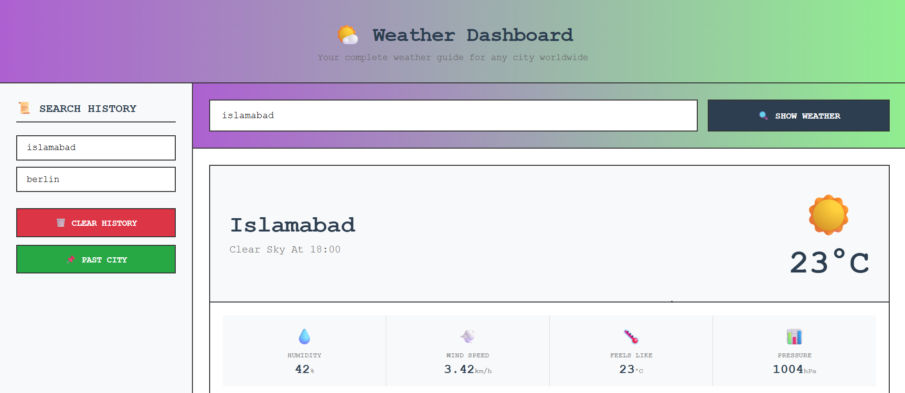

# 🌤️ Weather Dashboard

A modern, interactive weather application that provides real-time weather data and forecasts for any city worldwide. Built with vanilla HTML, CSS, and JavaScript.



## ✨ Features

### Current Weather
- Real-time temperature, humidity, wind speed, and pressure
- "Feels like" temperature and atmospheric pressure
- Weather condition description with custom emoji icons
- Dynamic weather icons based on condition codes

### 5-Day Forecast
- 5-day weather forecast with daily high temperatures
- **Hourly navigation** inside each day card (view weather at 3-hour intervals: 00:00, 03:00, 06:00, etc.)
- Horizontal slider for scrolling through days
- Responsive card layout

### Hourly Slider (Today)
- Interactive slider showing today's weather at 3-hour intervals
- Clickable time labels for quick navigation
- Updates main weather card in real-time

### Search History
- Persistent storage using browser's localStorage
- Click on any past city to reload its weather
- Prevents duplicate entries
- Limits history to last 10 searches
- "Clear History" and "Past City" buttons

### Error Handling
- Friendly error messages for invalid city names
- API failure handling
- Blank search prevention

### Responsive Design
- Two-column layout (history on left, weather on right)
- Mobile-friendly responsive breakpoints
- Console-style monospace font theme


## 🛠️ Technologies Used

- **HTML5** - Semantic structure
- **CSS3** - Flexbox, Grid, custom properties, responsive design
- **JavaScript (ES6+)** - Async/await, Fetch API, localStorage, DOM manipulation
- **OpenWeatherMap API** - Weather data provider

## 📋 Prerequisites

- An API key from [OpenWeatherMap](https://openweathermap.org/api)
- Modern web browser (Chrome, Firefox, Safari, Edge)

## 🔧 Installation

1. **Clone the repository**
   ```bash
   git clone https://github.com/yourusername/weather-dashboard.git
   cd weather-dashboar
